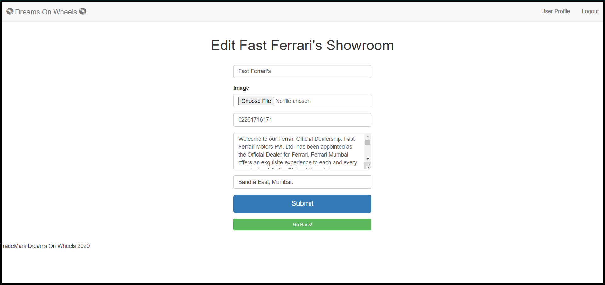

# Dreams-On-Wheels

**<ins>Full Stack Project On Exclusive Cars And Bikes Showroom Catalogue.</ins>**

**Welcome to Dreams On Wheels Project. Dreams On Wheels is a One Stop Website for Exclusive Cars And Bikes Showroom. Whether it's a new Car or a new Bike, this site can help you purchase you Exclusive ride. Showroom here feature Cars And Bikes from all the Top Brands. The Website features the list of Cars and Bikes Showrooms and their Information. Users can also make Account to post new Showrooms or leave Reviews to existing Showrooms. So what are you waiting for.. find the Showroom that suits you best and pick the Ride of your Dreams.**

**<ins>Check It Out At</ins> -**  https://dreams-on-wheels.herokuapp.com/   **(live hosting @Heroku).**

**<ins>Features Of The Website</ins> -**

**Sign Up and Add New User by providing Email-Id and Password.  ||  Add Information and Picture to User Profile.**

**Edit and View User Profile.  ||  Login with User Credentials and Logout.**

**Login and Add New Showrooms.  ||  Add New Showrooms by providing Showroom Information and Pictures.**

**Add Map Location to Showrooms. ||  Logged-In Users can Edit and Delete Showrooms.**

**All Users(Logged-In and Non-Logged-In) can view Showrooms and it's details(including Location on Map And Reviews).**

**Logged-In Users can add Comments/Reviews to Showrooms.**

**Logged-In Users can Edit and Delete Comments/Reviews from Showrooms.**

**Showrooms, Comments/Reviews and User Profile are associated to User and can only be Edited and Deleted by the User who owns them.**

**A User can be made Admin User by providing the Secret Key.**

**Admin Users can Edit and Delete Showrooms and Comments?Reviews added by any User.**

**<ins>Technologies Used</ins> -**

**Frontend- Using HTML, JavaScript, CSS, Bootstrap.  ||  Backend- Using Node Js.  ||   Database- MongoDB Atlas.**

**<ins>Packages and API's Used</ins> -**

**Express as Web Framework.  ||  Mongoose for MongoDB   || Router for Routing Information.**

**Passport for User Authentication(Login).  ||  Multer  for Image Uploads.  ||  Cloudinary for Storing Images on Cloud.**

**Flash for Flash Messages.  ||  Mapbox for Location of Showroom on Map.**

**<ins>Desktop View</ins> -**

 

 

 

**<ins>Mobile View</ins> -**

  
